# Suchanalyse: Häufigkeit von Zeichenketten

Von Matthias Unternährer, Pedro Alexandre Almeida Figueiredo und Tuan Binh Tran

# Einleitung

Dieses Handout beschreibt unsere eigene Lösung zur Python-Aufgabe "Suchanalyse: Häufigkeit von Zeichenketten".
Dabei sind unsere Funktion und Tests beschrieben. Auch unsere Gedanken sind festgehalten.

Die Ziele und Bewertung sind der Aufgabe Programmieren Grundlagen zu entnehmen: https://github.com/fhirter/Software-Engineering/blob/master/ProgrammingBasicsAndAlgorithms/Exercises/Basics/Tasks.md

# Suchen: Anforderungen

- Das Suchen der Zeichenkette beachtet die Gross- und Kleinschreibung (case-sensitive).
- Eine gesuchte Zeichenabfolge darf nicht nochmals für die Häufigkeit genutzt werden.
  - Beispiel: Wird im Text "ABBBC" nach "BB" gesucht, so ist die Häufigkeit 1 und nicht 2.
- Es wird die Häufigkeit von der gesuchten Zeichenkette ausgegeben.

# Projektstruktur

Das Repository ist im Github aufzufinden: https://github.com/TIATIP-24-A-a/TUBI_PEFI_MAUN_Suchen

Beischreibung der Projektstruktur:

- `/`: Root
  - `search.py`: Die Suchfunktion
  - `search_tests.py`: Unit-Tests, welche die Suchfunktion testet
  - `.gitignore`: Ignorieren von Dateien im Git
  - `README.md`: Das README File
  - `Protokoll.md`: Das Protokoll
  - `Handout.md`: Du bist hier
  - `.github`
    - `workflows`
      - `test.yml`: Workflow, welches die Unit-Tests ausführt. 

# Beschreibung der Suchfunktion

Die Suchfunktion akzeptiert zwei Parameter. Beim ersten Parameter handelt sich um den Text. Mit dem zweiten Parameter wird der Suchtext angegeben.

Die beiden Parameter werden nicht validiert. Dementsprechend schlägt die Funktion fehl, wenn es sich um keine Strings handelt.

Die Funktion initialisiert zum Start zwei Variablen:
- `occurrences = 0`: Die Häufigkeit der Zeichenkette im Text
- `currentIndex = 0`: Die nächste Indexposition im Text.

Nach der Initialisierung der benötigen Variablen, wird ein Loop gestartet. Dieser Loop wiederholt sich so lange bis der `currentIndex` grösser-gleich die Länge vom Text erreicht.
Bei jedem Loop durchgang wird Folgendes geprüft und ausgeführt:

1. Handelt es sich bei der momentanen Indexposition vom Text plus die Länge vom gesuchten Text, um die Zeichenkette?
   - Wenn ja, erhöhe die Häufigkeit um eins und erhöhe die Variable `currentIndex` um die Länge der gesuchten Zeichenkette minus eins.

2. Inkrementiere `currentIndex` um eins.

Sobald der Loop durch ist, wird die `occurrences` zurückgegeben.

# Unit Tests

Die Unit-Tests wurde im TDD-Verfahren erstellt.

Für die detaillierte Implementation siehe `search_test.py`.

# Workflow: Python Test ausführen
Der Workflow auf Github führt die Tests durch und liefert das Ergebnis.

Dieser wird automatisch ausgeführt, sobald neue Änderungen hinzukommen. Eine manuelle Auslösung ist ebenfalls möglich.

Der Ablauf ist wie gefolgt:

1. Der Workflow wird ausgelöst (manuell oder automatisch).
2. Das Repository wird geholt (checkout).
3. Setup Python wird ausgeführt, welches die vorgegebene Python Version herunterlädt und einrichtet.
4. Unit-Tests im `search_tests.py` werden ausgeführt.

# Erkenntnisse
- Online ist sehr viel über Python beschrieben.
- Die Collaboration mit Git ohne Branches führt zu Probleme.

# Quellen
- Python For-Loops: https://www.w3schools.com/python/python_for_loops.asp
- Iterating String using For Loop: https://sparkbyexamples.com/python/iterate-string-in-python-using-for-loop/
- Python Functions: https://www.w3schools.com/python/python_functions.asp
- Python unittest - Unit testing Framework: https://docs.python.org/3/library/unittest.html
- Python Variables: https://www.w3schools.com/python/python_variables.asp
