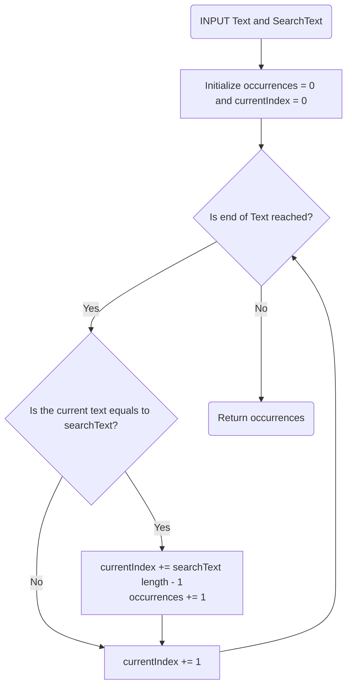

# Projekt 1 - TUBI_PEFI_MAUN_Suchen

Suchen einer Zeichenfolge in einem Text.
Zum Beispiel: Wie oft kommt "A" vor.

# Requirements

- Es ist Case-Sensitive
- Es kann nach einer Zeichenfolge gesucht werden

# Flow Chart


## Documentation
# 1. Zusammenfassung der Funktionsweise
Die Funktion searchText durchsucht den gesamten Text nach einem Suchbegriff (searchText). 
Sie zählt, wie oft dieser Begriff im Text vorkommt und gibt diese Anzahl zurück. 
Dabei wird der currentIndex so aktualisiert, dass die Funktion immer den nächsten Abschnitt 
im Text durchsucht und dabei sicherstellt, dass keine Vorkommen doppelt gezählt werden.

# 2. Funktionsdefinition
```python
def searchText(text, searchText):
```
Diese Zeile definiert die Funktion searchText. Sie nimmt zwei Argumente:
- text: Der Text, in dem nach einem bestimmten Muster gesucht werden soll.
- searchText: Der Text, nach dem gesucht wird (das Suchmuster).

# 3. Initialisierung der Variablen
```python
occurrences = 0
```
Diese Variable "occurrences" wird auf 0 gesetzt und dient dazu, 
die Anzahl der Vorkommen von "searchText" im "text" zu zählen.

```python
currentIndex = 0
```
Die Variable "currentIndex" wird auf 0 gesetzt. Sie wird verwendet,
um durch den text zu iterieren, also die aktuelle Position im text.

# 4. Schleife zum Durchlaufen des Textes
```python
while currentIndex < len(text):
```
Diese while-Schleife sorgt dafür, dass der Text durchlaufen wird, 
solange der "currentIndex" "kleiner als die Länge des Textes "(len(text)" ist. 
Die Schleife wird so lange ausgeführt, bis das Ende des Textes erreicht ist.

# 5. Bedingung zum Vergleichen von Teilstrings
```python
if text[currentIndex:currentIndex+len(searchText)] == searchText:
```
- In dieser Zeile wird geprüft, ob der Teil des Textes, der bei currentIndex beginnt und 
die Länge von searchText hat "(text[currentIndex:currentIndex+len(searchText)])", genau dem searchText entspricht.
text[currentIndex:currentIndex+len(searchText)] schneidet einen Teil des Textes aus, der so lang ist wie searchText, beginnend ab der Position currentIndex.
- Wenn dieser Teil des Textes mit searchText übereinstimmt, wird die Bedingung wahr.

# 6. Wenn ein Vorkommen gefunden wird
```python
occurrences += 1
```
-Wenn das Suchmuster gefunden wurde, wird der Zähler occurrences um 1 erhöht, um die Anzahl der gefundenen Vorkommen zu zählen.
```python
currentIndex += len(searchText)-1
```
Diese Zeile sorgt dafür, dass der currentIndex um die Länge von searchText minus 1 erhöht wird.
- Normalerweise wird currentIndex nach jeder Iteration um 1 erhöht (am Ende der Schleife). Aber hier wird es zusätzlich um len(searchText)-1 erhöht, wenn ein Vorkommen des Suchtextes gefunden wurde, um sicherzustellen, dass die Suche nicht das gleiche Vorkommen erneut findet.
- Beispiel: Wenn searchText 3 Zeichen lang ist, wird currentIndex nach einem Treffer um 2 Stellen weitergeschoben, sodass die Suche nicht von einem bereits gefundenen Vorkommen ausgeht.

# 7. Erhöhung des Index (allgemein)
```python
currentIndex += 1
```
Dies erhöht den "currentIndex" um 1. Dies passiert nach jeder Iteration, unabhängig davon, ob ein Treffer gefunden wurde oder nicht. 
Dadurch wird die Schleife von einem Zeichen zum nächsten im Text bewegt.

# 8. Rückgabe der Anzahl der Vorkommen (Resultat)
```python
return occurrences
```
Nachdem die Schleife den gesamten "Text" durchlaufen hat, wird der Wert von "occurrences" zurückgegeben. Dies gibt die Anzahl der Vorkommen von "searchText" im text zurück.